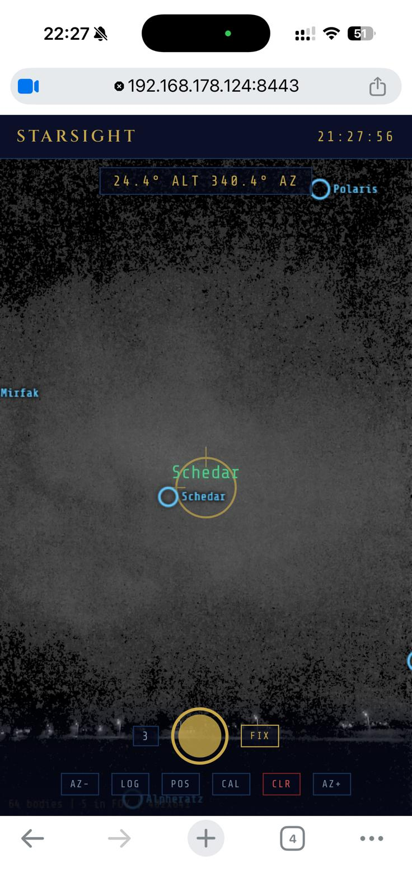
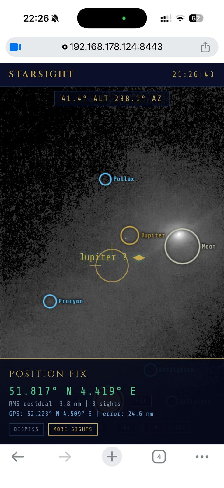

# Starsight

AR celestial navigation PWA. Point your phone at the sky to identify stars, capture sextant sights, and compute your position fix — no physical sextant required.

**[Launch Starsight](https://alexanderkeur-del.github.io/starsight/)** | Companion app to [Celestial Navigator](https://github.com/alexanderkeur-del/celestial-navigator)

<p float="left">
  
  
</p>

## Features

- **AR star overlay** — real-time star, planet, and Moon identification overlaid on the camera feed
- **Device orientation sextant** — uses phone gyroscope + compass as a sextant (altitude measurement ~1° accuracy)
- **Position fix** — multi-body Gauss-Newton circle-of-position fix from captured sights
- **Plate solving** — blind star identification from angular separation triangles (no assumed position needed)
- **Perpetual almanac** — VSOP87 Sun, Standish planetary elements, Meeus lunar theory, 58 navigational stars with J2000 proper motion + precession
- **Full Hs→Ho correction** — refraction, dip, index error, parallax, semi-diameter
- **Night vision mode** — gamma-boosted grayscale camera feed to enhance faint stars
- **GPS cross-check** — compare computed fix against GPS position for accuracy validation
- **Offline capable** — PWA with service worker, no internet required after first load

## Architecture

- `index.html` — AR camera sextant UI, all CSS inline
- `engine.js` — computation engine (ephemeris, correction, sight reduction, fix, plate solving)
- `sw.js` — service worker for offline PWA
- `manifest.json` — PWA manifest
- `serve-https.py` — local HTTPS dev server (camera requires secure context)
- `test-engine.js` — 22 computation tests (Node.js)

No build step, no frameworks, no dependencies. Plain JavaScript.

## Usage

### Local development

Camera and device orientation require HTTPS (except on `localhost`):

```bash
python3 serve-https.py    # HTTPS on port 8443 (self-signed cert)
```

Open `https://<your-ip>:8443/` on your phone. Accept the self-signed certificate warning.

### Running tests

```bash
node test-engine.js
```

### Taking sights

1. Grant camera and orientation permissions
2. Hold phone upright briefly to calibrate compass
3. Point at a bright star — the overlay will identify it
4. Tap the camera view to cycle between nearby candidates
5. Press the capture button to record a sight
6. Repeat for 2+ different bodies
7. Tap FIX to compute your position

### Controls

| Button | Function |
|--------|----------|
| Capture (gold circle) | Record current sight |
| FIX | Compute position from captured sights |
| LOG | View sight log |
| POS | Set assumed position manually |
| CAL | Reset compass calibration |
| AZ-/AZ+ | Fine-tune azimuth overlay alignment |
| CLR | Clear all sights |

## Accuracy

The phone gyroscope limits altitude accuracy to ~1° (~60 nautical miles). This is comparable to other phone sextant apps (e.g. CamSextant). For educational use and emergency backup navigation.

The computation engine (ephemeris, sight reduction, fix algorithms) is validated against JPL Horizons, Air Almanac 2026, and Nautical Almanac reference data to sub-arcminute precision.

## Comparison with CamSextant

| | CamSextant | Starsight |
|---|---|---|
| Platform | iOS/Android native | PWA (any device) |
| Fix method | 2-sight fix | Multi-body least-squares / Gauss-Newton |
| Blind identification | No | Plate solving from star triangles |
| Hs→Ho corrections | Basic | Full pipeline |
| Install required | App Store | No — open URL in browser |

## License

MIT
